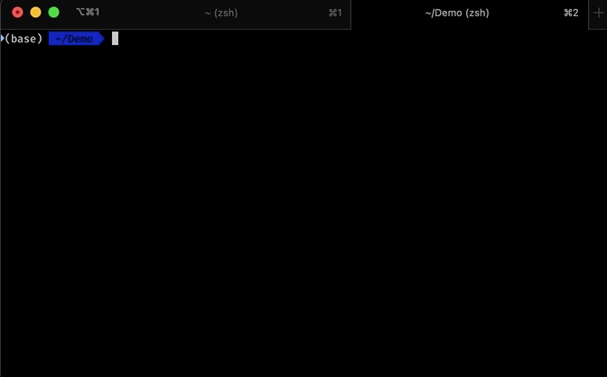

# Dev Cleaner
*Command line tool for finding and deleting development dependencies on your hard drive*

## What
This is a small (1.2MB) command line tool which finds folders of local development dependencies (`node_modules`, etc), and provides
a convenient terminal user interface to list and delete those folders.

## Why
As a software generalist, I use a lot of different languages, frameworks and tools on a daily basis, which leads to a lot of 
dependency clutter - folders like `node_modules`, `target`, `build`, `dist`, etc.
For active projects this is ok, but for paused projects or quick experiments, those folders just take up disk space (*this tiny project takes up ~500MB*) and slow down my backup system and virus scanner.   

  
Sure, I could just delete the projects and check them out of the VCS when I need them again, but that would be too easy.  
**Most importantly, I wanted to build something with `tui-rs` 🤷‍♂️**

## How to use
The project is written in Rust, therefore you need to have all the Rust dependencies installed (https://www.rust-lang.org/tools/install) 👀

Checkout the repository and run `cargo run YOUR/PATH/TO/SCAN` from the project folder to run it once, or build and install the project with `cargo install --path .` to a location known to your `PATH` and run `devcleaner YOUR/PATH/TO/SCAN` in your terminal.

The tool will scan all folders in the given path and collect all occurences of 
[`node_modules`, `target`, `build`, `dist`, `obj`, `venv`] and list them in your terminal.
You can then select the folders you want to get rid of and hit `d` to delete them.
